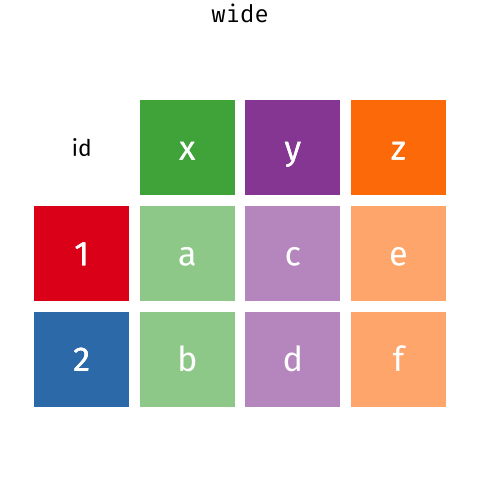

::::::::::::::::::::::::::::::::::::::: objectives

- Describe the concept of a wide and a long table format and for which purpose those formats are useful.
- Describe the roles of variable names and their associated values when a table is reshaped.
- Reshape a dataframe from long to wide format and back with the `pivot_wider` and `pivot_longer` commands from the **`tidyr`** package.
- Export a dataframe to a csv file.

::::::::::::::::::::::::::::::::::::::::::::::::::

:::::::::::::::::::::::::::::::::::::::: questions

- How can I reformat a data frame to meet my needs?

::::::::::::::::::::::::::::::::::::::::::::::::::

**`dplyr`** pairs nicely with **`tidyr`** which enables you to swiftly
convert between different data formats (long vs. wide) for plotting and analysis.
To learn more about **`tidyr`** after the workshop, you may want to check out this
[handy data tidying with **`tidyr`**
cheatsheet](https://raw.githubusercontent.com/rstudio/cheatsheets/main/tidyr.pdf).

To make sure everyone will use the same dataset for this lesson, we'll read
again the SAFI dataset that we downloaded earlier.


``` r
library(tidyverse)
library(here)

videos <- read_csv(
  here("data", "youtube-27082024-open-refine-200-na.csv"), 
  na = "na")
```

``` r
## inspect the data
videos
```

``` output
# A tibble: 200 × 32
   position randomise channel_id               channel_title      video_id url  
      <dbl>     <dbl> <chr>                    <chr>              <chr>    <chr>
 1      112       409 UCI3RT5PGmdi1KVp9FG_CneA eNCA               iPUAl1j… http…
 2       50       702 UCI3RT5PGmdi1KVp9FG_CneA eNCA               YUmIAd_… http…
 3      149       313 UCMwDXpWEVQVw4ZF7z-E4NoA StellenboschNews … v8XfpOi… http…
 4      167       384 UCsqKkYLOaJ9oBwq9rxFyZMw SOUTH AFRICAN POL… lnLdo2k… http…
 5      195       606 UC5G5Dy8-mmp27jo6Frht7iQ Umgosi Entertainm… XN6toca… http…
 6      213       423 UCC1udUghY9dloGMuvZzZEzA The Tea World      rh2Nz78… http…
 7      145       452 UCaCcVtl9O3h5en4m-_edhZg Celeb LaLa Land    1l5GZ0N… http…
 8      315       276 UCAurTjb6Ewz21vjfTs1wZxw NOSIPHO NZAMA      j4Y022C… http…
 9      190       321 UCBlX1mnsIFZRqsyRNvpW_rA Zandile Mhlambi    gf2YNN6… http…
10      214       762 UClY87IoUANFZtswyC9GeecQ Beauty recipes     AGJmRd4… http…
# ℹ 190 more rows
# ℹ 26 more variables: published_at <dttm>, published_at_sql <chr>, year <dbl>,
#   month <dbl>, day <dbl>, video_title <chr>, video_description <chr>,
#   tags <chr>, video_category_label <chr>, topic_categories <chr>,
#   duration_sec <dbl>, definition <chr>, caption <lgl>,
#   default_language <chr>, default_l_audio_language <chr>,
#   thumbnail_maxres <chr>, licensed_content <dbl>, …
```

``` r
## preview the data
# view(videos)
```

## Reshaping with pivot\_wider() and pivot\_longer()

There are essentially three rules that define a "tidy" dataset:

1. Each variable has its own column
2. Each observation has its own row
3. Each value must have its own cell

This graphic visually represents the three rules that define a "tidy" dataset:


*R for Data Science*, Wickham H and Grolemund G ([https://r4ds.had.co.nz/index.html](https://r4ds.had.co.nz/index.html))
© Wickham, Grolemund 2017
This image is licenced under Attribution-NonCommercial-NoDerivs 3.0 United States (CC-BY-NC-ND 3.0 US)

In this section we will explore how these rules are linked to the different
data formats researchers are often interested in: "wide" and "long". This
tutorial will help you efficiently transform your data shape regardless of
original format. First we will explore qualities of the `videos` data and
how they relate to these different types of data formats.

### Long and wide data formats

In the `videos` data, each row contains the values of variables associated
with each record collected (each interview in the villages). The `video_id` identifier is a unique
identifier for each YouTube video.


``` r
videos %>% 
  select(video_id) %>% 
  distinct() %>% 
  count()
```

``` output
# A tibble: 1 × 1
      n
  <int>
1   200
```

As seen in the code below, for each time of publication in each channel no
video_id`s are the same. Thus, this format is what is called a "long" data
format, where each observation occupies only one row in the dataframe.


``` r
videos %>%
  filter(channel_title == "eNCA") %>%
  select(video_id, channel_title, published_at_sql) %>%
  sample_n(size = 10)
```

``` output
# A tibble: 10 × 3
   video_id    channel_title published_at_sql   
   <chr>       <chr>         <chr>              
 1 vaSOdyC3iNk eNCA          2020-09-04 11:32:18
 2 huI9qbGqNhA eNCA          2020-09-07 17:59:13
 3 hZBwMrCCp4A eNCA          2020-09-08 16:49:28
 4 _Mz-QydrFMs eNCA          2020-09-07 7:17:10 
 5 flzoE9zL_KA eNCA          2020-09-07 11:28:32
 6 iPUAl1jywdU eNCA          2020-09-14 16:16:44
 7 -vdIFk95vPk eNCA          2020-09-07 8:23:46 
 8 RGXqGXPQNVE eNCA          2020-09-07 13:18:00
 9 li3_91gCQHc eNCA          2020-09-09 4:30:37 
10 3EtH4eDceFY eNCA          2020-09-10 9:11:44 
```

We notice that the layout or format of the `videos` data is in a format that
adheres to rules 1-3, where

- each column is a variable
- each row is an observation
- each value has its own cell

This is called a "long" data format. But, we notice that each column represents
a different variable. In the "longest" data format there would only be three
columns, one for the id variable, one for the observed variable, and one for the
observed value (of that variable). This data format is quite unsightly
and difficult to work with, so you will rarely see it in use.

Alternatively, in a "wide" data format we see modifications to rule 1, where
each column no longer represents a single variable. Instead, columns can
represent different levels/values of a variable. For instance, in some data you
encounter the researchers may have chosen for every survey date to be a
different column.

These may sound like dramatically different data layouts, but there are some
tools that make transitions between these layouts much simpler than you might
think! The gif below shows how these two formats relate to each other, and
gives you an idea of how we can use R to shift from one format to the other.


Long and wide dataframe layouts mainly affect readability. You may find that
visually you may prefer the "wide" format, since you can see more of the data on
the screen. However, all of the R functions we have used thus far expect for
your data to be in a "long" data format. This is because the long format is more
machine readable and is closer to the formatting of databases.

### Questions which warrant different data formats

In our dataset of YouTube videos, each row contains the values of variables associated with each
record (the unit), values such as the title of the channel which posted the video, the number
of views, or the title and description for the video. This format allows
for us to make comparisons across individual videos, but what if we wanted to
look at differences in videos grouped by different topics or tags associated with the video?

To facilitate this comparison we would need to create a new table where each row
(the unit) was comprised of values of variables associated with topics or tags
(i.e., the columns `topic_categories` or `tags` in the dataset). In practical terms this means the values of
the topics in `topic_categories` (e.g. politics, health,
business, society, etc.) would become the names of column variables and
the cells would contain values of `TRUE` or `FALSE`, for whether the video fitted into that category or not.

Once we we've created this new table, we can explore the relationship within and
between videos. The key point here is that we are still following a tidy data
structure, but we have **reshaped** the data according to the observations of
interest.

Alternatively, consider what we would do if the interview dates were spread across multiple columns, and
we were interested in visualizing how the controversy changed over time. 

This would require for the interview date to be included in a single column rather than spread across multiple columns. Thus,
we would need to transform the column names into values of a single variable.

We can do both of these transformations with two `tidyr` functions,
`pivot_wider()` and `pivot_longer()`.

## Pivoting wider

`pivot_wider()` takes three principal arguments:

1. the data
2. the *names\_from* column variable whose values will become new column names.
3. the *values\_from* column variable whose values will fill the new column
  variables.

Further arguments include `values_fill` which, if set, fills in missing values
with the value provided.

Let's use `pivot_wider()` to transform videos to create new columns for each
topic category allocated to a video.
There are a couple of new concepts in this transformation, so let's walk through
it line by line. First we create a new object (`videos_topics`) based on
the `videos` data frame.


``` r
videos_topics <- videos %>%
```

Then we will actually need to make our data frame longer, because we have 
multiple items in a single cell.
We will use a new function, `separate_longer_delim()`, from the **`tidyr`** package
to separate the values of `topic_categories` based on the presence of semi-colons (`;`).
The values of this variable were multiple items separated by semi-colons, so
this action creates a row for each item listed in a household's possession.
Thus, we end up with a long format version of the dataset, with multiple rows
for each respondent. For example, if a respondent has a television and a solar
panel, that respondent will now have two rows, one with "television" and the
other with "solar panel" in the `topic_categories` column.


``` r
separate_longer_delim(topic_categories, delim = ";") %>%
```

After this transformation, you may notice that the `topic_categories` column contains
`NA` values. This is because some of the respondents did not own any of the items
that was in the interviewer's list. We can use the `replace_na()` function to
change these `NA` values to something more meaningful. The `replace_na()` function
expects for you to give it a `list()` of columns that you would like to replace
the `NA` values in, and the value that you would like to replace the `NA`s. This
ends up looking like this:


``` r
replace_na(list(topic_categories = "no_categories")) %>%
```

Next, we create a new variable named `topic_categories_logical`, which has one value
(`TRUE`) for every row. This makes sense, since each item in every row was owned
by that household. We are constructing this variable so that when we spread the
`topic_categories` across multiple columns, we can fill the values of those columns
with logical values describing whether the household did (`TRUE`) or didn't
(`FALSE`) own that particular item.


``` r
mutate(topic_categories_logical = TRUE) %>%
```

{alt="Two tables shown side-by-side. The first row of the left table is highlighted in blue, and the first four rows of the right table are also highlighted in blue to show how each of the values of 'items owned' are given their own row with the separate longer delim function. The 'items owned logical' column is highlighted in yellow on the right table to show how the mutate function adds a new column."}

Lastly, we use `pivot_wider()` to switch from long format to wide format. This
creates a new column for each of the unique values in the `topic_categories` column,
and fills those columns with the values of `topic_categories_logical`. We also
declare that for topics that are missing, we want to fill those cells with the
value of `FALSE` instead of `NA`.


``` r
pivot_wider(names_from = topic_categories,
            values_from = topic_categories_logical,
            values_fill = list(topic_categories_logical = FALSE))
```

{alt="Two tables shown side-by-side. The 'items owned' column is highlighted in blue on the left table, and the column names are highlighted in blue on the right table to show how the values of the 'items owned' become the column names in the output of the pivot wider function. The 'items owned logical' column is highlighted in yellow on the left table, and the values of the bicycle, television, and solar panel columns are highlighted in yellow on the right table to show how the values of the 'items owned logical' column became the values of all three of the aforementioned columns."}

Combining the above steps, the chunk looks like this:


``` r
videos_topics <- videos %>%
  separate_longer_delim(topic_categories, delim = ";") %>%
  replace_na(list(topic_categories = "no_topics")) %>%
  mutate(topic_categories_logical = TRUE) %>%
  pivot_wider(names_from = topic_categories,
              values_from = topic_categories_logical,
              values_fill = list(topic_categories_logical = FALSE))
  videos_topics
```

``` output
# A tibble: 200 × 41
   position randomise channel_id               channel_title      video_id url  
      <dbl>     <dbl> <chr>                    <chr>              <chr>    <chr>
 1      112       409 UCI3RT5PGmdi1KVp9FG_CneA eNCA               iPUAl1j… http…
 2       50       702 UCI3RT5PGmdi1KVp9FG_CneA eNCA               YUmIAd_… http…
 3      149       313 UCMwDXpWEVQVw4ZF7z-E4NoA StellenboschNews … v8XfpOi… http…
 4      167       384 UCsqKkYLOaJ9oBwq9rxFyZMw SOUTH AFRICAN POL… lnLdo2k… http…
 5      195       606 UC5G5Dy8-mmp27jo6Frht7iQ Umgosi Entertainm… XN6toca… http…
 6      213       423 UCC1udUghY9dloGMuvZzZEzA The Tea World      rh2Nz78… http…
 7      145       452 UCaCcVtl9O3h5en4m-_edhZg Celeb LaLa Land    1l5GZ0N… http…
 8      315       276 UCAurTjb6Ewz21vjfTs1wZxw NOSIPHO NZAMA      j4Y022C… http…
 9      190       321 UCBlX1mnsIFZRqsyRNvpW_rA Zandile Mhlambi    gf2YNN6… http…
10      214       762 UClY87IoUANFZtswyC9GeecQ Beauty recipes     AGJmRd4… http…
# ℹ 190 more rows
# ℹ 35 more variables: published_at <dttm>, published_at_sql <chr>, year <dbl>,
#   month <dbl>, day <dbl>, video_title <chr>, video_description <chr>,
#   tags <chr>, video_category_label <chr>, duration_sec <dbl>,
#   definition <chr>, caption <lgl>, default_language <chr>,
#   default_l_audio_language <chr>, thumbnail_maxres <chr>,
#   licensed_content <dbl>, location_description <chr>, view_count <dbl>, …
```

View the `videos_topics` data frame. It should have
200 rows (the same number of rows you had originally), but
extra columns for each item. How many columns were added?
Notice that there is no longer a
column titled `topic_categories`. This is because there is a default
parameter in `pivot_wider()` that drops the original column. The values that
were in that column have now become columns named `politics`, `health`,
`business`, etc. You can use `dim(videos)` and
`dim(videos_wide)` to see how the number of columns has changed between
the two datasets.

This format of the data allows us to do interesting things, like make a table
showing the number of videos in each video category on a particular topic:


``` r
videos_topics %>%
  filter(politics) %>%
  group_by(video_category_label) %>%
  count(politics)
```

``` output
# A tibble: 4 × 3
# Groups:   video_category_label [4]
  video_category_label politics     n
  <chr>                <lgl>    <int>
1 Comedy               TRUE         1
2 Entertainment        TRUE         5
3 News & Politics      TRUE        24
4 People & Blogs       TRUE        10
```

Or below we calculate the average number of topics addressed by
each channel. This code uses the `rowSums()` function to count
the number of `TRUE` values in the `business` to `politics` columns for each row,
hence its name. Note that we replaced `NA` values with the value `no_topics`,
so we must exclude this value in the aggregation. We then group the data by
channel and calculate the mean number of topics, so each average is grouped
by channel.


``` r
videos_topics %>%
    select(-no_topics) %>% 
    mutate(number_topics = rowSums(select(., business:politics))) %>%
    group_by(channel_title) %>%
    summarize(mean_topics = mean(number_topics))
```

``` output
# A tibble: 119 × 2
   channel_title                 mean_topics
   <chr>                               <dbl>
 1 2nacheki                              1.5
 2 Absolute Controversy                  1  
 3 African Diaspora News Channel         1  
 4 Al Jazeera English                    2  
 5 Ayanda Mafuyeka                       1  
 6 Azana Jezile                          1  
 7 BANELE NOCUZE                         1  
 8 Banetsi Tshetlo                       1  
 9 Beauty recipes                        2  
10 Blackish Blue TV                      2  
# ℹ 109 more rows
```

## Pivoting longer

The opposing situation could occur if we had been provided with data in the form
of `videos_wide`, where the items owned are column names, but we
wish to treat them as values of an `topic_categories` variable instead.

In this situation we are gathering these columns turning them into a pair
of new variables. One variable includes the column names as values, and the
other variable contains the values in each cell previously associated with the
column names. We will do this in two steps to make this process a bit clearer.

`pivot_longer()` takes four principal arguments:

1. the data
2. *cols* are the names of the columns we use to fill the new values variable
  (or to drop).
3. the *names\_to* column variable we wish to create from the *cols* provided.
4. the *values\_to* column variable we wish to create and fill with values
  associated with the *cols* provided.


``` r
videos_long <- videos_topics %>%
  pivot_longer(cols = business:politics,
               names_to = "topic_categories",
               values_to = "topic_categories_logical")
```

View both `videos_long` and `videos_topics` and compare their structure.

:::::::::::::::::::::::::::::::::::::::  challenge

## Exercise

We created some summary tables on `videos_topics` using `count` and
`summarise`. We can create the same tables on `videos_long`, but this will
require a different process.

1. Make a table showing showing the number of videos from each channel categorised as a particular topic,
 and include all items. The difference between this
  format and the wide format is that you can now `count` all the topics using the
  `topic_categories` variable.

:::::::::::::::  solution

## Solution


``` r
videos_long %>%
  filter(topic_categories_logical) %>% 
  group_by(channel_title) %>% 
  count(topic_categories, sort=TRUE)
```

``` output
# A tibble: 171 × 3
# Groups:   channel_title [114]
   channel_title   topic_categories       n
   <chr>           <chr>              <int>
 1 SABC News       society               22
 2 eNCA            society               20
 3 eNCA            television_program    19
 4 SABC News       television_program    14
 5 Newzroom Afrika society               13
 6 Newzroom Afrika television_program    11
 7 SABC News       health                10
 8 eNCA            health                 8
 9 eNCA            politics               6
10 Newzroom Afrika politics               5
# ℹ 161 more rows
```

:::::::::::::::::::::::::

2. Calculate the average number of items from the list owned by
  respondents in each village. If you remove rows where `topic_categories_logical` is
  `FALSE` you will have a data frame where the number of rows per household is
  equal to the number of items owned. You can use that to calculate the mean
  number of items per village.

Remember, you need to make sure we don't count `no_listed_items`, since this is
not   an actual item, but rather the absence thereof.

:::::::::::::::  solution

## Solution


``` r
videos_long %>% 
  filter(topic_categories_logical,
         topic_categories != "no_topics") %>% 
  # to keep information per video, we count video_id
  count(video_id, channel_title) %>% # we want to also keep the channel variable
  group_by(channel_title) %>% 
  summarise(mean_topics = mean(n))
```

``` output
# A tibble: 114 × 2
   channel_title                 mean_topics
   <chr>                               <dbl>
 1 2nacheki                              1.5
 2 Absolute Controversy                  1  
 3 African Diaspora News Channel         1  
 4 Al Jazeera English                    2  
 5 Ayanda Mafuyeka                       2  
 6 Azana Jezile                          1  
 7 BANELE NOCUZE                         1  
 8 Banetsi Tshetlo                       1  
 9 Beauty recipes                        2  
10 Blackish Blue TV                      2  
# ℹ 104 more rows
```

:::::::::::::::::::::::::

::::::::::::::::::::::::::::::::::::::::::::::::::


## Applying what we learned to clean our data

Now we have simultaneously learned about `pivot_longer()` and `pivot_wider()`,
and fixed a problem in the way our data is structured. In the spreadsheets lesson,
we learned that it's best practice to
have only a single piece of information in each cell of your spreadsheet. In
this dataset, we have another column that stores multiple values in a single
cell. Some of the cells in the `tags` column contain multiple months
which, as before, are separated by semi-colons (`;`).

To create a data frame where each of the columns contain only one value per cell,
we can repeat the steps we applied to `topic_categories` and apply them to
`tags`. Since we will be using this data frame for the next episode,
we will call it `videos_plotting`.


``` r
videos_plotting <- videos %>%
  ## pivot wider by topic_categories
  separate_longer_delim(topic_categories, delim = ";") %>%
  ## if there were no topics listed, changing NA to no_listed_items
  replace_na(list(topic_categories = "no_topics")) %>%
  mutate(topic_categories_logical = TRUE) %>%
  pivot_wider(names_from = topic_categories,
              values_from = topic_categories_logical,
              values_fill = list(topic_categories_logical = FALSE)) #%>%
  ## pivot wider by tags
  #separate_longer_delim(tags, delim = ";") %>%
  #mutate(tags_logical = TRUE) %>%
  #pivot_wider(names_from = tags,
  #           values_from = tags_logical
  #          values_fill = list(tags_logical = FALSE)) %>%
  ## add some summary columns
  #mutate(number_tags = rowSums(select(., Jan:May))) %>% #replace with start and end tags
  #mutate(number_topics = rowSums(select(., business:politics)))

  videos_plotting
```

``` output
# A tibble: 200 × 41
   position randomise channel_id               channel_title      video_id url  
      <dbl>     <dbl> <chr>                    <chr>              <chr>    <chr>
 1      112       409 UCI3RT5PGmdi1KVp9FG_CneA eNCA               iPUAl1j… http…
 2       50       702 UCI3RT5PGmdi1KVp9FG_CneA eNCA               YUmIAd_… http…
 3      149       313 UCMwDXpWEVQVw4ZF7z-E4NoA StellenboschNews … v8XfpOi… http…
 4      167       384 UCsqKkYLOaJ9oBwq9rxFyZMw SOUTH AFRICAN POL… lnLdo2k… http…
 5      195       606 UC5G5Dy8-mmp27jo6Frht7iQ Umgosi Entertainm… XN6toca… http…
 6      213       423 UCC1udUghY9dloGMuvZzZEzA The Tea World      rh2Nz78… http…
 7      145       452 UCaCcVtl9O3h5en4m-_edhZg Celeb LaLa Land    1l5GZ0N… http…
 8      315       276 UCAurTjb6Ewz21vjfTs1wZxw NOSIPHO NZAMA      j4Y022C… http…
 9      190       321 UCBlX1mnsIFZRqsyRNvpW_rA Zandile Mhlambi    gf2YNN6… http…
10      214       762 UClY87IoUANFZtswyC9GeecQ Beauty recipes     AGJmRd4… http…
# ℹ 190 more rows
# ℹ 35 more variables: published_at <dttm>, published_at_sql <chr>, year <dbl>,
#   month <dbl>, day <dbl>, video_title <chr>, video_description <chr>,
#   tags <chr>, video_category_label <chr>, duration_sec <dbl>,
#   definition <chr>, caption <lgl>, default_language <chr>,
#   default_l_audio_language <chr>, thumbnail_maxres <chr>,
#   licensed_content <dbl>, location_description <chr>, view_count <dbl>, …
```
## Exporting data

Now that you have learned how to use **`dplyr`** and **`tidyr`** to wrangle your
raw data, you may want to export these new datasets to share them with your
collaborators or for archival purposes.

Similar to the `read_csv()` function used for reading CSV files into R, there is
a `write_csv()` function that generates CSV files from data frames.

Before using `write_csv()`, we are going to create a new folder, `data_output`,
in our working directory that will store this generated dataset. We don't want
to write generated datasets in the same directory as our raw data. It's good
practice to keep them separate. The `data` folder should only contain the raw,
unaltered data, and should be left alone to make sure we don't delete or modify
it. In contrast, our script will generate the contents of the `data_output`
directory, so even if the files it contains are deleted, we can always
re-generate them.

In preparation for our next lesson on plotting, we created a version of the
dataset where each of the columns includes only one data value. Now we can save
this data frame to our `data_output` directory.


``` r
write_csv (videos_plotting, file = "data_output/videos_plotting.csv")
```


:::::::::::::::::::::::::::::::::::::::: keypoints

- Use the `tidyr` package to change the layout of data frames.
- Use `pivot_wider()` to go from long to wide format.
- Use `pivot_longer()` to go from wide to long format.

::::::::::::::::::::::::::::::::::::::::::::::::::

