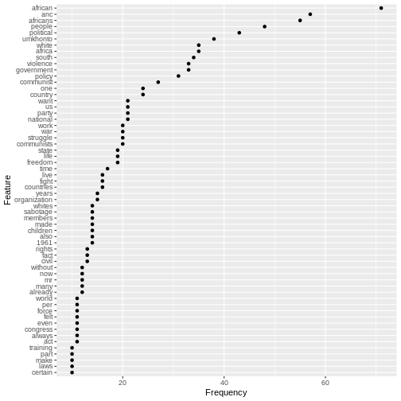
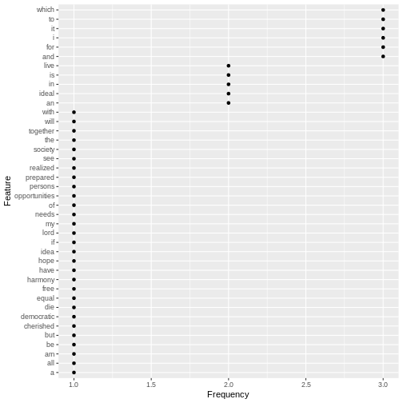

:::: instructor

- This is an optional lesson intended to introduce approaches to text as data by applying
  key concepts from corpus linguistics and natural language processing, with a focus on using
   computational approaches to qualitatively oriented discourse analysis.
- Note that his lesson was community-contributed and remains a work in progress. As such, it could
  benefit from feedback from instructors and/or workshop participants.

::::::::::::

::::::::::::::::::::::::::::::::::::::: objectives

- Introduce basic concepts needed to use the **`quanteda`** package for discourse analysis: corpus, tokens, dfm,and frequency.
- Prepare text for analysis with the **`quanteda`** functions `corpus`, `tokens`, `dfm`, and `dfm_remove`.
- Investigate the most frequent features in a dfm using the **`quanteda`** function `textstat_frequency`.
- Plot frequencies using **`ggplot`** 
- Select and modify a list of stopwords to remove unwanted words, query terms and spam from a dataset. 
- Visualise frequencies as a wordcloud using the **`quanteda`** function `textplot_wordcloud` and the **`wordcloud2`** function  `wordcloud2`.
- Identify the strengths and weaknesses of these approaches to visualising text data.


::::::::::::::::::::::::::::::::::::::::::::::::::

:::::::::::::::::::::::::::::::::::::::: questions

- What are the most important concepts for automating text analysis?
- How can I prepare text data for analysis?
- How can I visualise frequency, collocation and concordance for a corpus of textual data?

::::::::::::::::::::::::::::::::::::::::::::::::::

## Using **`quanteda`**

We will need to load the **`quanteda`** package which offers many useful text analysis functions.


``` r
library(quanteda)
```


## Computational linguistics and Corpus Linguistics

Computational linguistics and Corpus Linguistics are two related areas of study in linguistics. Both of these areas provide approaches which media scholars can use when analysing textual data in media texts.

Computational linguistics is a broad inter-disciplinary area of study where software and algorithms are developed to analyse and synthesise language and speech for applications such as machine translation, speech recognition, machine learning and deep learning ("AI"). Corpus linguistics has developed methods to study trends and patterns in language use by analysing large collections of electronically stored, naturally occurring texts. Both of these areas are related to Natural Language Processing (NLP) which is a subfield of computer science.

While Computational Linguistics has a strongly quantitative focus, Corpus Linguistics often includes qualitative analysis (such as examining concordance lines).  Corpus linguistics involves much qualitative work interpreting text, and so can be used to extend the scope of traditional media studies approaches to linguistic discourse such as Critical Discourse Analysis (CDA).

For more 

(Baker et al 2008:273)

## What is a Corpus?

A *corpus* is a set of documents which stores large quantities of real-life text. The plural form of the word is *corpora*.

You can find a set of South African language corpora on the [SADILAR corpus portal](https://corpus.sadilar.org/corpusportal/explore/corpus) website.

## Using a Document-Term Matrix

Computers work by using numbers, and so corpora are analysed by generating a numerical representations of text.

A popular representation of text in CL is the *Document-Term Matrix* or *DTM* (also known as Term-Document Matrix (TDM) or Document-Feature Matrix (DTM). 
A DTM represents a corpus as a large table (known as a matrix). 

We will study a small example of a document-term matrix, using this famous quotation from Nelson Mandela's 1964 speech during the Rivonia Trial: 

> "I have cherished the ideal of a democratic and free society in which all persons will live together in harmony and with equal opportunities. It is an idea for which I hope to live for and to see realized. But, my Lord, if it needs be, it is an ideal for which I am prepared to die."

In **quanteda** the function to create a DTM is `dfm()`, as it can be used for textual features other than individual words or tokens (e.g. emojis or punctuation marks). 

Each document has a separate row, each word has a separate column, and each cell has a number showing how often a particular word appears in a particular document.

We start by creating a list of the individual words in the sentences, which in **quanteda** uses the `tokens()` function. 
Our second step is to convert these words into a DTM using `dfm()`. For the purposes of this example, we will treat each sentence as a separate "text".


``` r
texts <- c(
      "I have cherished the ideal of a democratic and free society in which all persons will live together in harmony and with equal opportunities", 
"It is an idea for which I hope to live for and to see realized", 
"But my Lord if it needs be it is an ideal for which I am prepared to die")

d <- tokens(texts) %>%
  dfm()
```

We will take this DTM and look at its matrix structure, using the `convert()` function. 


``` r
convert(d, "matrix") 
```

``` output
       features
docs    i have cherished the ideal of a democratic and free society in which
  text1 1    1         1   1     1  1 1          1   2    1       1  2     1
  text2 1    0         0   0     0  0 0          0   1    0       0  0     1
  text3 1    0         0   0     1  0 0          0   0    0       0  0     1
       features
docs    all persons will live together harmony with equal opportunities it is
  text1   1       1    1    1        1       1    1     1             1  0  0
  text2   0       0    0    1        0       0    0     0             0  1  1
  text3   0       0    0    0        0       0    0     0             0  2  1
       features
docs    an idea for hope to see realized but my lord if needs be am prepared
  text1  0    0   0    0  0   0        0   0  0    0  0     0  0  0        0
  text2  1    1   2    1  2   1        1   0  0    0  0     0  0  0        0
  text3  1    0   1    0  1   0        0   1  1    1  1     1  1  1        1
       features
docs    die
  text1   0
  text2   0
  text3   1
```

The example matrix above shows the losses and the gains when we represent the closing sentences of Mandela's four hour long speech from the dock as a DTM. 

We lose the original word order of the conclusion to the speech, its poetic use of repetition and the impact of the final statement. 

At the same time, we gain other insights. Since we represent the speech in a numeric matrix format Mandela's linguistic choices are quantified and we can see certain lexical patterns. This draws attention to some rhetorical strategies, such as the repetition of the first person pronoun "I" and the repeated words "ideal" and "live", which lead up to the shock of the final emphatic "die". 

Furthermore, by converting the whole speech into the quantitative DTM format, we can more easily use computational methods to compare Mandela's 1964 speech to other famous speeches, such as his speech in 1994, or to speeches made by other political leaders and statesmen.

Now we will load the full text of the speech from a collection of speeches `speeches.tsv` to investigate these linguistic patterns.


``` r
# load file with text of political speeches
speeches <- read_tsv(
  here("data","speeches.tsv"),
  na= ""
)
```

``` output
Rows: 2 Columns: 7
── Column specification ────────────────────────────────────────────────────────
Delimiter: "\t"
chr (7): first_name, president, date, delivery, type, party, text

ℹ Use `spec()` to retrieve the full column specification for this data.
ℹ Specify the column types or set `show_col_types = FALSE` to quiet this message.
```

Now that we have loaded the collection we can select only the Rivonia speech using `filter()`. 

Then we will use the `corpus()`, `tokens()` and `dfm()`functions to represent the speech as a DTM. 


``` r
# select only the Rivonia speech, tokenize and convert to a DTM

d <- speeches %>%
  filter(date == "April 20 1964" ) %>%
  corpus() %>%
  tokens(remove_punct=T) %>%
  dfm()
```
Once the speech is converted to a DTM, we can use other functions to explore its linguistic patterns. 


``` r
head(d)
```

``` output
Document-feature matrix of: 1 document, 2,154 features (0.00% sparse) and 6 docvars.
       features
docs      i am the first accused hold   a bachelor's degree  in
  text1 179 12 751     9       1    2 171          1      1 264
[ reached max_nfeat ... 2,144 more features ]
```
The `head()` function tells us that the resulting DFM has 2154 tokens. It is a sparse matrix, (0.00% sparse). In other words, very few of the 2154 words are ever repeated. 

The function `topfeatures()` highlights the most commonly used words in the speech. Unsurprisingly, these are common words in English such as "I", "the", "a" and "in".


``` r
topfeatures(d)
```

``` output
 the   of   to  and   in    i    a that  was this 
 751  461  387  339  264  179  171  152  140  107 
```

Making sense of such frequencies requires us to understand an important concept in computational analysis of text, namely **frequency**.

# Using Word Frequencies to Analyse Text

Frequency is a key concept underpinning the analysis of text and corpora. As a purely quantitative measure, media researchers need to use word frequencies with a sensitivity to the word-distribution patterns in human languages, and the importance of context for meaning

Word frequency lists are an important starting point and can help direct an investigation. We combine them with measures of dispersion, which are used to reveal trends across texts. For example, certain linguistic patterns may occur more often at the beginning or ends of texts.

At the same time, frequencies can be reductive and generalising. If we're interested in meaning it's important not to oversimplify, and focusing only on word distributions can obscure more interesting interpretations of a text.

# Why is frequency important?

Language is not a random affair - it is *rule based*. Words are likely to occur predictably in relationship to other words. 

At the same time, human beings use language creatively and people can make many choices about how they want to use language. Language has *rule-generating* qualities which is why it changes over time and varies depending on the context where it is used. 

# The relationship between frequency and ideology

Media studies builds on the insights of discourse analysis and corpus linguistics, which have sensitised researchers to the ideological implications of the words people choose to use.


> "If people speak or write in an unexpected way, or make one linguistic choice over another, more obvious one, then that reveals something about their intentions, whether conscious or not." (Baker:48)


## Charting frequencies with **`quanteda`**

Using the `textstat_frequency()` function and `ggplot()` we can chart the most frequently used 60 words (features) from Mandela's speech:


``` r
tstat_freq_d <- textstat_frequency(d, n = 60)

feature_freq <- ggplot(tstat_freq_d, aes(x = frequency, y = reorder(feature, frequency))) +
  geom_point() +
  labs(x = "Frequency", y = "Feature")
feature_freq
```




## Grammatical/Function words

The chart shows us that the most commonly used words in the speech as a whole are similar to the common English words we saw repeated in the final sentences.These words are known as grammatical or function words and are the most commonly used in a language. They seldom change over short periods of time.

For this reason, grammatical and function words are on lists of words to be excluded from frequency counts. These lists are known as "stop words"

## Lexical words

By contrast, the frequencies of the lexical words in Mandela's speech ("African", "ANC", "Africans", "people", "political", "umkhonto", "Africa", "white", "South","violence", "government","policy","against","communist") show us what this specific text or corpus is about.

## Defining stopwords

We can start identifying these important lexical words by excluding common English words from our analysis:


``` r
## exclude common english words
mystopwords <- stopwords("english",
                         source="snowball")
```

## Removing stopwords

After removing stopwords from the DTM using the function `dfm_remove()` we can chart frequencies for the most common lexical words used in the Rivonia speech.


``` r
d <- d %>%
  dfm_remove(mystopwords)

tstat_freq_d <- textstat_frequency(d, n = 60)

feature_freq <- ggplot(tstat_freq_d, aes(x = frequency, y = reorder(feature, frequency))) +
  geom_point() +
  labs(x = "Frequency", y = "Feature")
feature_freq
```



With the stop words excluded, the chart shows us more clearly what the speech was about.

## Wordclouds and visualisation

Wordclouds are a popular visualisation format for frequencies because they allow us to focus on meanings.


``` r
topfeatures(d)
```

``` output
  african       anc  africans    people political  umkhonto    africa     white 
       71        57        55        48        43        38        35        35 
    south  violence 
       34        33 
```

``` r
textplot_wordcloud(d, max_words=100)
```


:::::::::::::::::::::::::::::::::::::::  challenge

## Exercise

How would you go about using quanteda functions to study linguistic choices in the inaugural speech given by Mandela when he became President on 10 May 1994? 
What are the strengths of using ggplot and textplot_wordcloud to represent textual data?

:::::::::::::::  solution

## Solution


``` r
d <- speeches %>%
  filter(date == "10 May 1994" ) %>%
  corpus() %>%
  tokens(remove_punct=T) %>%
  dfm()  %>%
  dfm_remove(mystopwords)

topfeatures(d)
```

``` output
     us   world  people country   peace   human   south     let freedom   never 
      9       8       8       6       6       5       5       5       4       4 
```

``` r
textplot_wordcloud(d, max_words=20)
```


:::::::::::::::::::::::::

Pro: The frequency plot using ggplot allows for precise comparisons and shows the exact frequency for each word. 

Con: As a visualisation it is not as intuitively read for meaning.

Pro: The wordcloud allows quick exploration of the meaning of a speech. 

Con: Wordclouds can give undue emphasis to long words. 

Both visualisations rely on simple frequency counts, which split up multi-word concepts like "south africa".

::::::::::::::::::::::::::::::::::::::::::::::::::


:::::::::::::::::::::::::::::::::::::::: keypoints

- Use the **`quanteda`** package to analyse text data.
- Use `corpus()`, `tokens()`,`dfm()`, `dfm_remove()` and stopword lists to prepare text for analysis.
- Use `textstat_frequency` to investigate the most frequently used tokens or features in a dfm. 
- Plot frequencies using **`ggplot`** and the **`quanteda`** function `textplot_wordcloud`.

::::::::::::::::::::::::::::::::::::::::::::::::::


