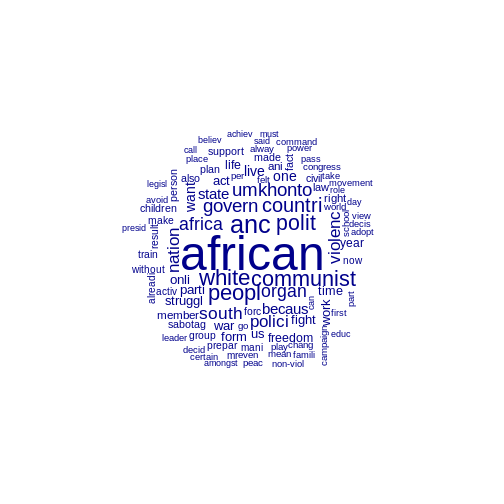

:::: instructor

- This is an optional lesson intended to introduce approaches to text as data by applying
  key concepts from corpus linguistics and natural language processing, with a focus on using
   computational approaches to qualitatively oriented discourse analysis.
- Note that his lesson was community-contributed and remains a work in progress. As such, it could
  benefit from feedback from instructors and/or workshop participants.

::::::::::::

::::::::::::::::::::::::::::::::::::::: objectives

- Introduce basic concepts needed to use the **`quanteda`** package for discourse analysis: corpus, tokens, dfm,and frequency.
- Prepare text for analysis with the **`quanteda`** functions `corpus`, `tokens`, `dfm`, and `dfm_remove`.
- Investigate the most frequent features in a dfm using the **`quanteda`** function `textstat_frequency`.
- Plot frequencies using **`ggplot`** 
- Select and modify a list of stopwords to remove unwanted words from a dataset. 
- Visualise frequencies as a wordcloud using the **`quanteda`** function `textplot_wordcloud`.
- Identify the strengths and weaknesses of these approaches to visualising text data.

::::::::::::::::::::::::::::::::::::::::::::::::::

:::::::::::::::::::::::::::::::::::::::: questions

- What are the most important concepts for automating text analysis?
- How can I prepare text data for analysis?
- How can I visualise frequency, collocation and concordance for a corpus of textual data?

::::::::::::::::::::::::::::::::::::::::::::::::::
## Using **`quanteda`** for text analysis
Before conducting automated text analysis, we will need to install and load a suitable package.
For this tutorial we will be using the **`quanteda`** package which offers many useful text analysis functions.


``` r
# install.packages("quanteda")
library(quanteda)
```
## Example data
We will start by exploring the text from some historical speeches by Nelson Mandela. 
You can download the required data [from this link](data/speeches.tsv)

## Using automated text analysis for media research
Classic approaches to media research can be expanded and enhanced by using computational approaches such as automated text analysis. Nonetheless it is important for researchers to know where these new tools originate and what they assume about language. This tutorial is intended to provide a foundation for media researchers who would like to use computational tools for discourse analysis on collections of textual data such as social media posts, web pages, text output from machine vision services, or interview transcripts. These techniques have their roots in both computational linguistics and corpus linguistics.

Computational linguistics and Corpus Linguistics are two related areas which provide different approaches, concepts and tools for analysing textual data.

Media scholars have used corpus linguistics together with discourse analysis to explore dominant discourses, and to investigate the social implications of certain linguistic choices. Computational linguistics has been used to automate some aspects of content analysis, such as sentiment analysis (which identifies positive and negative sentiments in text) or to label texts or automatically identify topics . In all these cases, researchers need to manage textual data and to prepare it for analysis by sorting, categorising and summarising it.

Computational linguistics is a broad inter-disciplinary area of study where software and algorithms are developed to analyse and synthesise language and speech for applications such as machine translation, speech recognition, machine learning and deep learning ("AI"). Corpus linguistics has developed methods to study trends and patterns in language use and sociolinguistic variation by analysing large collections of electronically stored, naturally occurring texts. Both of these areas are also related to Natural Language Processing (NLP) which is a subfield of computer science.

While Computational Linguistics has a strongly quantitative focus, Corpus Linguistics can also include qualitative analysis (such as examining concordance lines).  Corpus linguistics involves much qualitative work interpreting text, and so can be used to extend the scope of Critical Discourse Analysis (CDA) and other smaller-scale media studies approaches to analysing linguistic discourse.

For more about these approaches, see these additional readings below.

## References

Baker, P. et al. (2008) A useful methodological synergy? Combining critical discourse analysis and corpus linguistics to examine discourses of refugees and asylum seekers in the UK press. Discourse & society. [19 (3), 273–306.

Baker, P. 2006. Using Corpora in Discourse Analysis. Continuum: London. 

Van Atteveldt, W. & T. Peng, (2018) When Communication Meets Computation: Opportunities, Challenges, and Pitfalls in Computational Communication Science, Communication Methods and Measures, 12:2-3, 81-92, DOI: 10.1080/19312458.2018.1458084

Theocharis, Y. & A. Jungherr (2020) Computational Social Science and the Study of Political Communication, Political Communication, DOI: 10.1080/10584609.2020.1833121


## What is a Corpus?
A *corpus* is a set of documents which stores large quantities of real-life text. The plural form of the word is *corpora*.

You can find a set of South African language corpora on the [SADILAR corpus portal](https://corpus.sadilar.org/corpusportal/explore/corpus) website.

In this tutorial you can think of the corpus as your back-up or raw data which needs to be kept unchanged by the analysis. The individual documents which make up the corpus can be labelled and stored separately from one another in the corpus format.

## Using a Document-Term Matrix
Computers work by using numbers, and so corpora are analysed by generating a numerical representations of text.

A popular representation of text in CL is the *Document-Term Matrix* or *DTM* (also known as Term-Document Matrix (TDM) or Document-Feature Matrix (DFM). 

A DTM represents a corpus as a large table (known as a matrix) which organises all the words (terms) in the corpus according to how often they occur in each of the documents included in the corpus.

We will start with a small example of a document-term matrix, using this famous quotation from Nelson Mandela's 1964 speech during the Rivonia Trial: 

> "I have cherished the ideal of a democratic and free society in which all persons will live together in harmony and with equal opportunities. It is an idea for which I hope to live for and to see realized. But, my Lord, if it needs be, it is an ideal for which I am prepared to die."

Once we understand how a short paragraph like this is represented numerically as a DFM, we will use a larger DFM to compare Mandela's linguistic choices across different speeches made in 1964 and in 1994.

In **quanteda** the function to create a DTM is `dfm()`, as it can be used for textual features other than individual words or tokens (e.g. emojis or punctuation marks). 

In a DTM, each document is allocated a separate row. (In this case we are treating each sentence as a separate row.) Each word in the document has a separate column. (As a result a DTM can be extremely wide.) Each cell has a number showing how often a particular word appears in a particular document.

We start by creating a list of the individual words in the sentences, which in **quanteda** uses the `tokens()` function. 
Our second step is to convert these words into a DTM using `dfm()`. For the purposes of this example, we will treat each sentence as a separate "text".


``` r
texts <- c(
      "I have cherished the ideal of a democratic and free society
      in which all persons will live together in harmony and with equal
      opportunities", 
      "It is an idea for which I hope to live for and to see realized", 
      "But my Lord if it needs be it is an ideal for which I am prepared 
      to die")

d <- tokens(texts) %>%
  dfm()
```

Let's take the DTM created by the dfm() function and look more closely at its matrix structure.

Since it's a very wide matrix with 40 columns, we will focus on the first 10 words, or features.


``` r
print(d) 
```

``` output
Document-feature matrix of: 3 documents, 40 features (56.67% sparse) and 0 docvars.
       features
docs    i have cherished the ideal of a democratic and free
  text1 1    1         1   1     1  1 1          1   2    1
  text2 1    0         0   0     0  0 0          0   1    0
  text3 1    0         0   0     1  0 0          0   0    0
[ reached max_nfeat ... 30 more features ]
```

The example matrix above shows the losses and the gains when we represent the closing sentences of Mandela's four hour long speech from the dock as a DTM. 

We lose the original word order of the conclusion to the speech, its poetic use of repetition and the impact of the final statement. 

At the same time, we gain other insights. Since we represent the speech in a numeric matrix format Mandela's linguistic choices are quantified and we can see certain lexical patterns. This draws attention to some rhetorical strategies, such as the repetition of the first person pronoun "I" and the repeated words "ideal" and "live", which lead up to the shock of the final emphatic "die". 

Furthermore, by converting the whole speech into the quantitative DTM format, we can more easily use computational methods to compare Mandela's 1964 speech to other famous speeches, such as his speech in 1994, or to speeches made by other political leaders and statesmen.

## Creating a corpus

We need to load the full text of the speech from a collection of speeches (`speeches.tsv`) and create a reference corpus to investigate these linguistic patterns.


``` r
# load file with text of political speeches
speeches <- read_tsv(
  here("data","speeches.tsv"),
  na= ""
)
```

``` output
Rows: 2 Columns: 7
── Column specification ────────────────────────────────────────────────────────
Delimiter: "\t"
chr  (6): first_name, president, delivery, type, party, text
date (1): date

ℹ Use `spec()` to retrieve the full column specification for this data.
ℹ Specify the column types or set `show_col_types = FALSE` to quiet this message.
```
Our dataframe includes a column with the full text of the speeches, as well as   various other metadata for the speeches.


``` r
colnames(speeches)
```

``` output
[1] "first_name" "president"  "date"       "delivery"   "type"      
[6] "party"      "text"      
```
 Now that we have loaded the collection we create a unique "docid" column for each speach. Using`mutate()` we combine the year of the speech with the name of the speaker, and the mode of delivery. Then we select only the Rivonia speech using `filter()`. 

Now we can use the `corpus()` function to convert the dataframe to a corpus object.


``` r
# select only the Rivonia speech and convert to a DTM

d_corpus <- speeches %>%
  mutate(doc_id=paste(year(date), president, delivery)) %>%
  filter(year(date) == "1964" ) %>%
  corpus()
```

## Tokens - preparing for analysis

Tokens are usually the words in a document. (They can also be sentences.) We will now prepare the text for analysis by deciding what tokens are important for us to address the research question.

In many cases, we will not want to keep all of the tokens in a text. For example, we might convert all words to lowercase, remove punctuation and numbers, and stem words to reduce the size of the eventual matrix. Of course, in cases where numbers or punctuataion are important to our analysis, we would keep them intact!

In this case we will remove all punctuation and numbers.


``` r
# tokenize, remove punctuation and number, and convert to a DTM

d <- d_corpus %>%
  tokens(remove_punct = T, remove_numbers = T) %>%
  dfm()
```

## Starting Analysis - the DTM

Once the speech is converted to a DTM with the `dtm()` function, we can start exploring its linguistic patterns. 


``` r
head(d)
```

``` output
Document-feature matrix of: 1 document, 2,119 features (0.00% sparse) and 6 docvars.
                     features
docs                    i am the first accused hold   a bachelor's degree  in
  1964 Mandela speech 179 12 751     9       1    2 171          1      1 264
[ reached max_nfeat ... 2,109 more features ]
```
The `head()` function tells us that the resulting DFM has 2154 tokens. It is a sparse matrix, (0.00% sparse). In other words, very few of the 2154 words are ever repeated. 

The function `topfeatures()` highlights the most commonly used words in the speech. Unsurprisingly, these are common words in English such as "I", "the", "a" and "in".

We will likely need to remove these words - unless we are specifically interested in Mandela's use of pronouns. But first let us see what the frequency distribution looks like with them in the text.

## Charting frequencies with **`quanteda`**

Using the `textstat_frequency()` function and `ggplot()` we can chart the most frequently used 60 words (features) from Mandela's speech:


``` r
topfeatures(d)
```

``` output
 the   of   to  and   in    i    a that  was this 
 751  461  387  339  264  179  171  152  140  107 
```

``` r
tstat_freq_d <- textstat_frequency(d, n = 60)

feature_freq <- ggplot(tstat_freq_d, aes(x = frequency, y = reorder(feature, frequency))) +
  geom_point() +
  labs(x = "Frequency", y = "Feature")

feature_freq
```


## Grammatical/Function words

The chart shows us that the most commonly used words in the speech as a whole are similar to the common English words we saw repeated in the final sentences.These words are known as grammatical or function words and are the most commonly used in a language. They seldom change over short periods of time.

For this reason, grammatical and function words are on lists of words to be excluded from frequency counts. These lists are known as "stop words"

## Lexical words

By contrast, the frequencies of the lexical words in Mandela's speech ("African", "ANC", "Africans", "people", "political", "umkhonto", "Africa", "white", "South","violence", "government","policy","against","communist") give far more clues if we're interested in what this specific text or corpus is about.

## Defining stopwords

We can start identifying these important lexical words by excluding common English words from our analysis:


``` r
## exclude common english words
mystopwords <- stopwords("english",
                         source="snowball")
str(mystopwords)
```

``` output
 chr [1:175] "i" "me" "my" "myself" "we" "our" "ours" "ourselves" "you" ...
```

``` r
mystopwords
```

``` output
  [1] "i"          "me"         "my"         "myself"     "we"        
  [6] "our"        "ours"       "ourselves"  "you"        "your"      
 [11] "yours"      "yourself"   "yourselves" "he"         "him"       
 [16] "his"        "himself"    "she"        "her"        "hers"      
 [21] "herself"    "it"         "its"        "itself"     "they"      
 [26] "them"       "their"      "theirs"     "themselves" "what"      
 [31] "which"      "who"        "whom"       "this"       "that"      
 [36] "these"      "those"      "am"         "is"         "are"       
 [41] "was"        "were"       "be"         "been"       "being"     
 [46] "have"       "has"        "had"        "having"     "do"        
 [51] "does"       "did"        "doing"      "would"      "should"    
 [56] "could"      "ought"      "i'm"        "you're"     "he's"      
 [61] "she's"      "it's"       "we're"      "they're"    "i've"      
 [66] "you've"     "we've"      "they've"    "i'd"        "you'd"     
 [71] "he'd"       "she'd"      "we'd"       "they'd"     "i'll"      
 [76] "you'll"     "he'll"      "she'll"     "we'll"      "they'll"   
 [81] "isn't"      "aren't"     "wasn't"     "weren't"    "hasn't"    
 [86] "haven't"    "hadn't"     "doesn't"    "don't"      "didn't"    
 [91] "won't"      "wouldn't"   "shan't"     "shouldn't"  "can't"     
 [96] "cannot"     "couldn't"   "mustn't"    "let's"      "that's"    
[101] "who's"      "what's"     "here's"     "there's"    "when's"    
[106] "where's"    "why's"      "how's"      "a"          "an"        
[111] "the"        "and"        "but"        "if"         "or"        
[116] "because"    "as"         "until"      "while"      "of"        
[121] "at"         "by"         "for"        "with"       "about"     
[126] "against"    "between"    "into"       "through"    "during"    
[131] "before"     "after"      "above"      "below"      "to"        
[136] "from"       "up"         "down"       "in"         "out"       
[141] "on"         "off"        "over"       "under"      "again"     
[146] "further"    "then"       "once"       "here"       "there"     
[151] "when"       "where"      "why"        "how"        "all"       
[156] "any"        "both"       "each"       "few"        "more"      
[161] "most"       "other"      "some"       "such"       "no"        
[166] "nor"        "not"        "only"       "own"        "same"      
[171] "so"         "than"       "too"        "very"       "will"      
```
It's always a good idea to look carefully at what stopwords are being removed. In this case, notice that pronoouns (e.g. "us" and "them") as well as negative terms ("not" or "no") are on the stoplist. These could be important for understanding discourse around collective identity, and so we may want to come back to add or remove words from the list at a later stage. 

## Removing stopwords
After removing stopwords from the DTM using the function `dfm_remove()` we can chart frequencies for the most common lexical words used in the Rivonia speech.


``` r
d <- d %>%
  dfm_remove(mystopwords)

tstat_freq_d <- textstat_frequency(d, n = 60)

feature_freq <- ggplot(tstat_freq_d, aes(x = frequency, y = reorder(feature, frequency))) +
  geom_point() +
  labs(x = "Frequency", y = "Feature")
feature_freq
```


Once the grammatical/function words have been excluded with the stopword list, the frequency chart shows more clearly what the speech was about. 

Before we start to make sense of these word frequencies in Mandela's speech, we should pause briefly and reflect on an important concept in computational analysis of text, namely **frequency**.

# Using Word Frequencies to Analyse Text
Frequency is a key concept underpinning the analysis of text and corpora. As a purely quantitative measure, media researchers need to use word frequencies with a sensitivity to the word-distribution patterns in human languages, and the importance of context for meaning

Word frequency lists are an important starting point and can help direct an investigation. We combine them with measures of dispersion, which are used to reveal trends across texts. For example, certain linguistic patterns may occur more often at the beginning or ends of texts.

At the same time, frequencies can be reductive and generalising. If we're interested in meaning it's important not to oversimplify. Focusing only on general patterns and individual word distributions without paying attention to context can obscure what is going on in a text.

## Why is frequency important?
Language is not a random affair - it is *rule based*. Words are likely to occur predictably in relationship to other words. 

At the same time, human beings use language creatively and people can make many choices about how they want to use language. Language has *rule-generating* qualities which is why it changes over time and varies depending on the context where it is used. 

## The relationship between frequency and ideology
Media studies builds on the insights of discourse analysis and corpus linguistics, which have sensitised researchers to the ideological implications of the words people choose to use.

> "If people speak or write in an unexpected way, or make one linguistic choice over another, more obvious one, then that reveals something about their intentions, whether conscious or not." (Baker:48)

## Wordclouds and visualisation
Wordclouds are a popular visualisation format for frequencies because they allow us to focus on meanings.


``` r
topfeatures(d)
```

``` output
  african       anc  africans    people political  umkhonto    africa     white 
       71        57        55        48        43        38        35        35 
    south  violence 
       34        33 
```

``` r
textplot_wordcloud(d, max_words=100)
```


We notice the duplication of related words, such as "africa", "african" or "africans". It is possible to combine these by using by using the `tokens_wordstem()` function, which will reduce all words to their stems. 


``` r
topfeatures(d)
```

``` output
  african       anc  africans    people political  umkhonto    africa     white 
       71        57        55        48        43        38        35        35 
    south  violence 
       34        33 
```

``` r
d <- d_corpus %>%
  tokens(remove_punct = T, remove_numbers = T) %>%
  tokens_wordstem()%>%
  dfm()  %>%
  dfm_remove(mystopwords)

textplot_wordcloud(d, max_words=100)
```




:::::::::::::::::::::::::::::::::::::::  challenge

## Exercise
How would you go about using quanteda functions to study linguistic choices in the inaugural speech given by Mandela when he became President on 10 May 1994? 

:::::::::::::::  solution

## Solution


``` r
d <- speeches %>%
  mutate(doc_id=paste(lubridate::year(date), president, delivery)) %>%
  filter(lubridate::year(date) == "1994" ) %>%
  corpus() %>%
  tokens(remove_punct=T) %>%
  dfm()  %>%
  dfm_remove(mystopwords)

topfeatures(d)
```

``` output
     us   world  people country   peace   human   south     let freedom   never 
      9       8       8       6       6       5       5       5       4       4 
```

``` r
textplot_wordcloud(d, max_words=20)
```


:::::::::::::::::::::::::

The most frequent word in the 1994 speech is "us". Edit the stopword list to check for frequency of other pronouns which may be used to construct a group identity. 


:::::::::::::::  solution


``` r
## edit the list of stopwords
mystopwords <- mystopwords[! mystopwords %in% c('we', 'they', 'i')]

d <- d_corpus %>%
    tokens(remove_punct = T, remove_numbers = T) %>%
  dfm() %>%
  dfm_remove(mystopwords)

textplot_wordcloud(d, max_words=20)
```


:::::::::::::::::::::::::


What are the pros and cons of using ggplot and textplot_wordcloud to represent textual data?

:::::::::::::::  solution

## Solution
**Using a wordcloud**

Pro: The wordcloud allows quick exploration of the meaning of a speech. 

Con: Wordclouds can give undue emphasis to long words. 

**Using a ggplot feature-frequency chart**

Pro: The frequency plot using ggplot allows for precise comparisons and shows the exact frequency for each word. 

Con: As a visualisation a frequency plot is not as intuitively read for meaning.

**Using any visualisation of simple frequencies**

Wordclouds and frequency plots both rely on simple frequency counts, which don't handle negatives well e.g. ("not violent" vs "violent") and also split up multi-word concepts like "south africa".

:::::::::::::::::::::::::

::::::::::::::::::::::::::::::::::::::::::::::::::

:::::::::::::::::::::::::::::::::::::::: keypoints

- Use the **`quanteda`** package to analyse text data.
- Use `corpus()`, `tokens()`,`dfm()`, `dfm_remove()` and stopword lists to prepare text for analysis.
- Use `textstat_frequency` to investigate the most frequently used tokens or features in a dfm. 
- Plot frequencies using **`ggplot`** and the **`quanteda`** function `textplot_wordcloud`.

::::::::::::::::::::::::::::::::::::::::::::::::::


